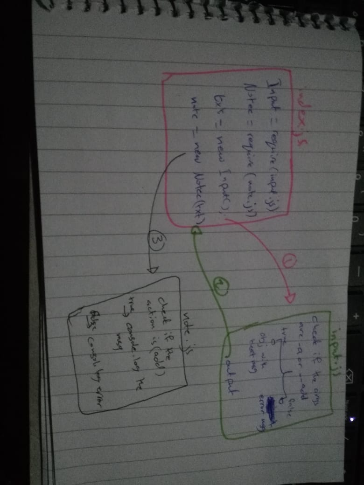

# LAB - 01
## Node Ecosystem
### Author: Israa Othman
### Links and Resources

- [submission PR for lab01](https://github.com/401-advanced-javascript-israaOthman/notes/pull/2)
- [submission PR for lab02](https://github.com/401-advanced-javascript-israaOthman/notes/pull/5)
- [submission PR for lab03](https://github.com/401-advanced-javascript-israaOthman/notes/pull/6)
- [submission PR for lab04](https://github.com/401-advanced-javascript-israaOthman/notes/pull/9)


### Modules
#### `Node.js`
### Packages
#### `minimist`
#### How to initialize/run your application (where applicable)

``` 
 1- to add a new note :
    - e.g. `node index.js --add 'some note --category 'some category'`
    - e.g. `node index.js -a 'some note' --category 'some category'`
    - e.g. `./index.js --add 'some note' --category 'some category'`
    - e.g. `./index.js -a 'some note' --category 'some category'`
 
 2a- to list every note in the Database :
    - e.g. `node index.js --list`
 2b- to list specifice categoery :
    - e.g. `node index.js --list category `

 3- to delete a note :
    - e.g. `node index.js --delete 'valid id' `

 4- to update note :
    - e.g. `node index.js --update 'updated note' --id 'valid id' `

```


#### How to use your library (where applicable)
#### Tests
- Test: '`node index.js (anything except [--add || -a || --delete || --list || --update]) 'creating my first note'`' => 'you should add a valid command'
#### UML
